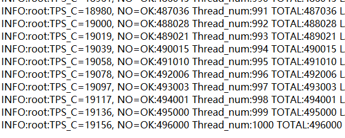

# bookstore期末作业报告

[](https://travis-ci.com/swzhangslg/bookstore)   [](https://codecov.io/gh/swzhangslg/bookstore)

## 项目目录结构

```
bookstore
  |-- be                            后端
        |-- model                   功能实现
        |-- view                    flask view
        |-- __init__.py             
        |-- db_conn.py                 
        |-- serve.py
  |-- doc                           JSON API
  |-- fe                            前端
        |-- access                  各功能http访问
        |-- bench                   效率(吞吐量)测试
        |-- data                    
            |-- book.db             sqlite 数据库(book.db，较少量的测试数据)
            |-- scraper.py          从豆瓣爬取的图书信息数据
        |-- test                    功能性及覆盖率测试
        |-- conf.py                 测试参数
        |-- conftest.py             pytest初始化配置
        |-- ...                      
 |-- init_database                  初始化数据库的文件
 |-- app.py                         启动flask                     
 |-- script
  |-- ....
```

## 安装配置

安装python

安装依赖

```
pip install -r requirements.txt
```

安装postgresql数据库，并建库“bookstore”

初始化数据库

```
python init_database.py
```

执行测试

```
bash script/test.sh
```

吞吐量与延迟测试：先启动app，再运行run.py


## 第一部分 数据库设计


### E-R图

1. 实体类和子类
   
   实体类：用户、商铺、订单和书籍。
   
   用户的子类：买家和卖家。
   
   订单的子类：订单详情。
   
2. 属性
   用户包含：唯一属性user_id，单值属性密码、余额、终端和token（登陆的用户token不会重复，未登录的用户token为空）。

   订单包含：唯一属性order_id，单值属性订单应付款金额和订单创建时间、状态属性（0为已付款，1为已发货，2为已收货, 3为已下单未付款,4为交易关闭）。
   店铺包含：唯一属性store_id。

   书籍包含：唯一属性book_id，单值属性标题、作者、出版商、isbn号、原价等。

3. 联系

   买家和订单：一个买家可以对应多笔订单，但一笔订单只能对应一个买家。

   卖家和订单：一个卖家可以对应多笔订单，但一笔订单只能对应一个卖家。

   卖家和商铺：一个卖家可以拥有多个商铺，但一家商铺只能对应一个卖家。

   商铺和书籍：一家商铺可以存有多款书籍，一款书也可以被多家商铺存有。

   订单和书籍：一个订单可以购买多款书籍，一款书也可以被多笔订单所购买。

   订单和商铺：一家商铺可以拥有多笔订单，但一笔订单只能对应一家商铺。

### 关系模式和索引设计

**用户表(user)**

| user_id                                                      | password | balance | token  | terminal |
| ------------------------------------------------------------ | -------- | ------- | ------ | -------- |
| String(primary_key)                                          | String   | Integer | String | String   |
| user_id是主键，通过user_id进行查找，例如登录时查看密码是否正确，用户充值时查看还剩多少余额。设计满足第三范式。 |          |         |        |          |

**用户和商铺关系表(store)**

| store_id                                                     | user_id             |
| ------------------------------------------------------------ | ------------------- |
| String(primary_key)                                          | String(Foreign Key) |
| store_id是主键，user_id作为外键，加快商家查看店铺操作的速度。满足第三范式。 |                     |

**商铺详情表(store_detail)**

| store_id                                                     | book_id                          | stock_level | price   |
| ------------------------------------------------------------ | -------------------------------- | ----------- | ------- |
| String(primary_key, Foreign Key)                             | String(primary_key, Foreign Key) | Integer     | Integer |
| store_id和book_id组成联合主键，对store_id和book_id都作为外键，加快搜索时根据书找到对应的店铺和根据店铺找到店铺内的书。满足第三范式。 |                                  |             |         |

**书籍表(book)**

| book_id                       | title  | author | publisher | ...  | original_price | picture     |
| ----------------------------- | ------ | ------ | --------- | ---- | -------------- | ----------- |
| String(primary_key)           | String | String | String    | ...  | Integer        | LargeBinary |
| book_id是主键。满足第三范式。 |        |        |           |      |                |             |

**订单表(order)**

| order_id                                                  | user_id             | store_id            | paytime  | status  |
| --------------------------------------------------------- | ------------------- | ------------------- | -------- | ------- |
| String(primary_key)                                       | String(Foreign Key) | String(Foreign Key) | DateTime | Integer |
| order_id是主键，user_id和store_id作为外键。满足第三范式。 |                     |                     |          |         |

**订单详情表(order_detail)**

| order_id                                                     | book_id                          | count   |
| ------------------------------------------------------------ | -------------------------------- | ------- |
| String(primary_key)                                          | String(primary_key, Foreign Key) | Integer |
| order_id和book_id组成联合主键，由于订单和书本是多对多关系，因此我们需要建立一张额外的订单详情表。满足第三范式。 |                                  |         |

**待付款订单表(order_to_pay)**

| order_id                                                     | user_id             | store_id            | paytime  |
| ------------------------------------------------------------ | ------------------- | ------------------- | -------- |
| String(primary_key)                                          | String(Foreign Key) | String(Foreign Key) | DateTime |
| order_id是主键，鉴于我们引入自动取消超时订单功能，设定每秒查询一次未付款订单，为降低检索复杂度增强检索效率，故分离出单独存储未付款订单的表，不再添加额外索引。满足第三范式。 |                     |                     |          |

## 第二部分 功能实现

### 基本功能

#### 用户功能

1. 注册

   1. 根据user_id判断该用户名是否已经存在。
   2. 插入user_id、password、balance、token、terminal信息至user表。

2. 登录

   1. 根据user_id获取用户密码。
   2. 与用户输入密码对比。
   3. 更新token，terminal。

3. 登出

   1. 根据user_id查询该user是否处于登陆状态。
   2. 更新token。

4. 注销

   1. 根据user_id查询该user是否存在。
   2. 删除对应user表中条目。

5. 更改密码

   1. 根据user_id获取用户原有密码。
   2. 与用户输入的旧密码对比。
   3. 若相同，更新用户密码。


#### 买家功能

1. 下单

   1. 根据买家下单信息user_id和store_id在store表中查找商户信息，并进入store_detail表中查看店铺具体信息。
   2. 根据解析买家传入的book_id和count信息，在store_detail表中查找商户是否存在对应书籍和足够的库存。
   3. 若库存充足，则减少对应数量的库存，并在order_detail表中插入对应的订单信息：order_id，book_id，count。
   4. 当买家一个订单中的所有商品都可购买，并且购买记录均已加入order_detail后，在order_to_pay表（已下单未付款表）中插入订单记录，记录相应order_id，user_id，store_id，paytime。

2. 付款
   1. 查询在order_to_pay表中是否存在属于该买家的待支付订单，若存在，则获取相应的store_id。
   2. 对买家信息进行校验，检查user_id及password是否相对应或正确。
   3. 校验通过，检查买家余额是否大于待支付订单总价，若资金足够，则付款成功，并根据卖家user_id在usr表中给卖家增加资金，否则失败。
   4. 对成功付款的订单，将其记录转移到order表中，更新paytime为订单支付时间，并加入status=0，表示订单已付款未发货。并将其从order_to_pay表中删除。
3. 用户充值
   1. 根据user_id获取用户密码，并与用户输入密码进行对比。 
   2. 若密码正确，根据用户输入add_value在usr表中更新其余额。

#### 卖家功能

1. 创建店铺

   1. 检查user_id和store_id是否已存在。
   2. 插入用户id，新建店铺store_id至user_store表。

2. 上架图书

   1. 检查user_id和store_id是否已存在。
   2. 根据book_id从book表查询是否存在对应book。
   3. 若不存在，首先将书本信息插入book表。
   4. 将store_id, book_id, 出售价格插入store表。

3. 添加库存

   1.检查user_id、store_id和book_id是否已存在。

   2.根据store_id, book_id寻找对应店家书本库存，并在store表中更新库存。

### 扩展功能

#### 图书搜索功能

搜索方式包括：搜索标题、搜索作者、搜索标签、搜索内容关键字

搜索范围包括：全局搜索和店铺内搜索

搜索实现：倒排索引

搜索方式

根据标题搜索：由于有的书标题过长，读者不一定能完全记住，所以在构建标题的倒排索引时不仅仅记录标题内容，还提取了标题内部的信息。在处理中文标题时采用jieba分词方法，在精确模式的基础上，对长词再次切分，提高召回率，若分词结果不包含标题，需加上标题本身。而在处理英文标题时直接按空格提取单词，再加上标题本身即可。
根据作者搜索：人名对于大多数人不太容易记住，尤其是英文人名。而且读者往往倾向于记住人名前面的信息，因此采用提示词的方式构建倒排索引，依次取人名的前几个字或字母构建词项。
根据标签搜索：由于标签已经存在，直接拿来构建倒排索引即可。
根据内容关键词进行搜索：我们从书的内容简介中提取一些内容关键词便于用户搜索。对书的内容简介先jieba分词，再去除停用词，用jieba.analyse.extract_tags的方法，从中提取ti-idf最大的20个关键词，再构建倒排索引。

搜索范围

全局搜索：参数传入需要搜索方式（标题、作者或关键词），在对应的倒排索引表中查找对应的book_id，再在书的表中根据book_id找到这本书的相关信息。
店铺搜索：参数传入需要搜索方式（标题、作者或关键词）和store_id，在对应的倒排索引表中查找对应的book_id，并且在store_detail店铺库存详情表中根据store_id找出所有的book_id，取book_id的交集再在书的表中根据book_id找到这本书的相关信息。

分页显示结果

由于某些查询词对应了多本书，查询返回结果可能太大，故采用分页显示查询结果的方式。每次查询时，传入一个参数page（大于等于1，一般取1），实现每次返回10行结果作为一页。

#### 收发货功能

买家收货

1. 检查order_id是否存在于order表中。
2. 检查order的status是否为0或2。
3. 查看user_id与buyer_id是否一致。
4. 若以上都满足，置order的status为2。

卖家发货

​	1.检查order_id是否存在。

​	2.查询order的状态是否为已付款。

​	3.看store的店铺主是不是seller。

​	4.将order的状态置为1。

#### 查询和取消订单功能

1. 买家取消订单
   1. 根据order_id和user_id在order_to_pay及order表中查找订单信息。
   2. 若订单记录存在于order_to_pay表中，则该订单只下单未付款，只需获取store_id后为卖家加回库存，再删掉表中记录即可。最后，在order表中加上相应记录，设置status为4，表示订单已关闭。
   3. 若订单记录存在于order表中，检测该记录status是否对应0（已付款未发货），因为此处需注意已发货和已收货的订单不能取消。之后，获取对应卖家user_id和store_id，加回库存的同时一同完成资金转移。最后，更改order表中记录，设status为4。
2. 买家查询历史订单
   1. 根据买家user_id在order及order_to_pay表中进行查询，并根据paytime按时间排列。
   2. 若查询记录不为空，则依次获取查询所得的每条记录的信息（order_id，user_id，store_id，order_detail：（book_id，count，single_price），paytime，status），并计算每格订单的总价total_price，将每条记录以字典的形式插入historys列表中。
   3. 返回historys（当无订单记录时，返回一个空数组），并将其包装成json对象。
3. 自动检测超时未付款订单并取消
   1. 调用Timer类实现自动取消订单。Timer是Thread的子类，通过Timer(t, fun)函数设置每t秒调用一次fun函数。并且，我们通过start()和cancel()函数设置线程开始或取消执行。
   2. 每次调用函数，将查询在order_to_pay表中是否存在待支付订单。对于所有存在的记录，我们获取其记录中的paytime，并与当前时间做差，若时间差大于15min，则自动取消关闭该订单。
   3. 对每一个超时应关闭的订单，获取记录对应的order_id，user_id，store_id，并根据store_id将卖家商铺的库存加回。
   4. 最后，我们将此条要关闭订单的对应记录加入order表，并设置status为4，之后删除order_to_pay表中的记录。

## 第三部分 测试及性能分析

### 测试及代码覆盖率

pytest测试--57个test全部passed


代码覆盖率--96%


### 订单吞吐量和延迟




延迟：0.0254秒/笔
吞吐量：19156笔/秒

## 第四部分 分工及版本控制

## 项目分工

| 项目成员 | 完成任务                                                     |
| -------- | ------------------------------------------------------------ |
| 张硕闻   | 数据库设计、卖家基础功能、订单发货收货功能、testcase编写测试、ppt及报告编写 |
| 杜涵悦   | 数据库设计、买家基础功能、手动取消订单功能、查询历史订单功能、自动取消订单功能、testcase编写测试、ppt及报告编写 |
| 陈煜     | 数据库设计、用户基础功能、图书搜索功能、testcase编写测试、ppt及报告编写 |

### 版本控制

github仓库：[swzhangslg/bookstore (github.com)](https://github.com/swzhangslg/bookstore)

具体使用如下：

合作开发，每位成员都是项目的合作者。每个人建立自己的分支，将项目克隆到本地。


- 个人控制：

  本地维护多个branch，以作为备份和多功能的分离实现，若需合并再使用merge。

- 多人合作：

  个人提交：每次写自己部分的代码时及时拉取master分支的代码至本地，确保每人编写代码时代码内容都是最新的。每次提交代码时，先push到远程自己的分支，再发起pull request请求合并到主分支，get merge解决冲突后合并，以确保master代码最新且无误。

项目开发pull request记录：


### 持续集成

每次commit后立刻进行测试，利用Travis与Codecov，显示测试是否通过以及覆盖率，点击文件头图标连接可查看细节：


